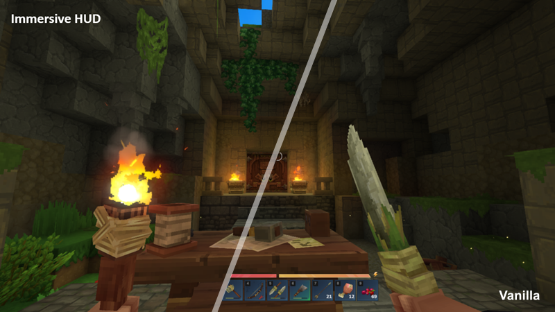

<p style="text-align:center; margin-bottom:-32px">

</p>

<p style="text-align:center;"></p>

# Immersive HUD

ImmersiveHud is a lightweight, fully configurable Hytale plugin that dynamically hides and reveals HUD elements based on player actions and gameplay context.

With a flexible trigger system and ready-to-use profiles, it shows only what matters, when it matters, delivering a cleaner, more immersive experience without losing critical information.

By T0m.R4nD0m / [t0mr4nd0m@gmail.com](mailto:t0mr4nd0m@gmail.com)


---

## ✨ Features

- Dynamic HUD visibility based on gameplay
- Configurable triggers per component
- Built-in config profiles (default, immersive, disabled)
- Per-player configuration
- Lightweight and performance-friendly

---

## ⚡ Quick Start

Get ImmersiveHud running in under a minute:

### 1. Install the plugin

- **CurseForge App** : (recomended)
  - Install [CurseForge App](https://www.curseforge.com/download/app)
  - Search 'ImmersiveHud' mod and install it


- **Manually** :
  - Download the latest release `.jar` from the [Releases](https://github.com/t0mr4nd0m/hytale.immersivehud/releases) page
  - Place it in your Hytale\UserData\Mods folder

  >   Windows: %appdata%\Hytale\UserData\Mods

  >   Linux: ~/.local/share/Hytale/UserData/Mods

  >   macOS: ~/Library/Application Support/Hytale/UserData/Mods

### 2. Start your server
- Launch your Hytale server and activate the plugin

### 3. You're done
The HUD will now dynamically hide and show based on gameplay actions and conditions.

---

💡 Tip: Use `/ihud status` to inspect your current HUD configuration.

---

## 📖 How it works

ImmersiveHud combines two visibility models.

### 🅰️ Static visibility

A static HUD component is always hidden or visible.

Example: Input bindings, Notifications, Player list, Chat,...

---

💡 Tip: Use command `/ihud toggle` <component> to define HUD components visibility

---

### ️🅱️ Dynamic visibility

Dynamic HUD components are normally hidden and become visible when specific gameplay triggers occur.

* Dynamic HUD component behaviour is defined by the dynamic rules assigned to it.
* Different rules can be applied to same component to react to different triggers.
* If no rules are assigned to the dynamic component, it will behave as a static component.

Examples:
- showing the hotbar when changing the slot selected
- showing health bar when damage is taken
- showing the reticle when looking at a workbench or aiming with a bow

---

💡 Tip: Use command `/ihud rules` <rules> to define dynamic components visibility behaviour

---

## ▶️ Commands

Commands to set up and personalize ImmersiveHUD behaviour per player

- affect only the current player
- are persisted automatically
- override the global config

| Command   | Parameters                        | Description                                                 | Example                                 |
|-----------|-----------------------------------|-------------------------------------------------------------|-----------------------------------------|
| `status`  | none                              | Displays the current visibility state of all HUD components | /ihud status                            |
| `toggle`  | `<component>`                     | Toggles visibility of a specific HUD component              | /ihud toggle health                     |
| `toggle`  | `<component>` `<state>`           | Hides/Shows a component                                     | /ihud toggle health hide                |
| `toggle`  | `<group>` `<state>`               | Hides/Shows all components in a group                       | /ihud toggle ui hide                    |
| `rules`   | `<component>` list                | List rules from a component                                 | /ihud rules health list                 |
| `rules`   | `<component>` clear               | Clear rules from a component                                | /ihud rules health clear                |
| `rules`   | `<component>` add/remove `<rule>` | Add or remove rules to/from component                       | /ihud rules health add  HEALTH_CRITICAL |
| `profile` | `<profile>`                       | Apply quick IHud configuration based on different profiles  | /ihud profile immersive                 |

| Parameter     | Description           | Values                                 |
|---------------|-----------------------|----------------------------------------|
| `<component>` | Hud component         | [Hud Components](#-hud-components)     |
| `<state>`     | Visibility state      | `[Hide/Show]`                          |
| `<group>`     | Hud group             | `[Core/Bars/UI/Social/Panels/Builder]` |
| `<rule>`      | Trigger Rules         | [Rules](#-rules)                       |
| `<profile>`   | Configuration Profile | [Profiles](#-profiles)                 |

---

💡 Tip: Use command `/ihud profile` to quickly apply a base configuration profile and then toggle components visibility and/or add or remove rules to customize your personal experience

---

## 📘 HUD Components

HUD components supported by ImmersiveHUD

| Component                         | Group   | Type    | Default state | Default rules                                                                                   |
|-----------------------------------|---------|---------|---------------|-------------------------------------------------------------------------------------------------|
| hotbar                            | Core    | Dynamic | Hidden        | `HOTBAR_INPUT`                                                                                  |
| compass                           | Core    | Dynamic | Hidden        | `PLAYER_MOVING`                                                                                 |
| reticle                           | Core    | Dynamic | Hidden        | `CHARGING_WEAPON` `CONSUMABLE_USE` `TARGET_ENTITY` `INTERACTABLE_BLOCK` `HOLDING_RANGED_WEAPON` |
| health                            | Bars    | Dynamic | Hidden        | `HEALTH_NOT_FULL`                                                                               |
| stamina                           | Bars    | Dynamic | Hidden        | `STAMINA_CRITICAL`                                                                              |
| mana                              | Bars    | Dynamic | Hidden        | `MANA_CRITICAL`                                                                                 |
| oxygen                            | UI      | Static  | Visible       | —                                                                                               |
| inputbindings                     | UI      | Static  | Hidden        | —                                                                                               |
| notifications                     | UI      | Static  | Hidden        | —                                                                                               |
| statusicons                       | UI      | Static  | Visible       | —                                                                                               |
| speedometer                       | UI      | Static  | Visible       | —                                                                                               |
| ammo                              | UI      | Static  | Visible       | —                                                                                               |
| utilityslotselector               | UI      | Static  | Visible       | —                                                                                               |
| chat                              | Social  | Static  | Visible       | —                                                                                               |
| requests                          | Social  | Static  | Visible       | —                                                                                               |
| killfeed                          | Social  | Static  | Visible       | —                                                                                               |
| playerlist                        | Social  | Static  | Visible       | —                                                                                               |
| eventtitle                        | Panels  | Static  | Visible       | —                                                                                               |
| objectivepanel                    | Panels  | Static  | Visible       | —                                                                                               |
| portalpanel                       | Panels  | Static  | Visible       | —                                                                                               |
| sleep                             | Panels  | Static  | Visible       | —                                                                                               |
| blockvariantselector              | Builder | Static  | Visible       | —                                                                                               |
| buildertoolslegend                | Builder | Static  | Visible       | —                                                                                               |
| buildertoolsmaterialslotselector  | Builder | Static  | Visible       | —                                                                                               |

---

## 🏷️ Rules

Rules to define the visibility behaviour of dynamic HUD components

| Rule                    | Trigger condition                           |
|-------------------------|---------------------------------------------|
| `HOTBAR_INPUT`          | Player changes hotbar selection             |
| `CHARGING_WEAPON`       | Player is aiming or charging a weapon       |
| `CONSUMABLE_USE`        | Player is consuming food or potion          |
| `TARGET_ENTITY`         | Player is targeting an entity               |
| `INTERACTABLE_BLOCK`    | Player is looking at an interactable blocks |
| `PLAYER_MOVING`         | Player is moving                            |
| `PLAYER_WALKING`        | Player is walking                           |
| `PLAYER_RUNNING`        | Player is running                           |
| `PLAYER_SPRINTING`      | Player is sprinting                         |
| `PLAYER_MOUNTING`       | Player is mounting                          |
| `PLAYER_FLYING`         | Player is fying                             |
| `PLAYER_GLIDING`        | Player is gliding                           |
| `PLAYER_JUMPING`        | Player is jumping                           |
| `PLAYER_CROUCHING`      | Player is crouching                         |
| `PLAYER_CLIMBING`       | Player is climbing                          |
| `PLAYER_IN_FLUID`       | Player is in fluid                          |
| `PLAYER_ON_GROUND`      | Player is on ground                         |
| `PLAYER_FALLING`        | Player is falling                           |
| `PLAYER_SITTING`        | Player is sitting                           |
| `PLAYER_ROLLING`        | Player is rolling                           |
| `HOLDING_MELEE_WEAPON`  | Player is holding a melee weapon            |
| `HOLDING_RANGED_WEAPON` | Player is holding a ranged weapon           |
| `HEALTH_NOT_FULL`       | Health bar is not full                      |
| `HEALTH_LOW`            | Health bar is below 50%                     |
| `HEALTH_CRITICAL`       | Health bar is below 25%                     |
| `STAMINA_NOT_FULL`      | Stamina bar is not full                     |
| `STAMINA_LOW`           | Stamina bar is below 50%                    |
| `STAMINA_CRITICAL`      | Stamina bar is below 25%                    |
| `MANA_NOT_FULL`         | Mana bar is not full                        |
| `MANA_LOW`              | Mana bar is below 50%                       |
| `MANA_CRITICAL`         | Mana bar is below 25%                       |

---

💡 Tip: multiple rules can be combined to alter component behaviour. Ex. Hotbar rules=`HOTBAR_INPUT`, `CHARGING_WEAPON` -> when changes hotbar slot and when aiming.

---

##  🎮 Profiles

Profiles provide predefined HUD configurations for different playstyles.  
You can switch between them instantly using commands.

| Profile     | Description                                       |
|-------------|---------------------------------------------------|
| `default`   | Balanced. Shows HUD components only when relevant |
| `immersive` | Minimal HUD, maximum immersion                    |
| `disable`   | HUD always visible (vanilla-like)                 |

---

## ⚙️ Configuration

ImmersiveHud uses two configuration layers:

1. Server configuration (Global)
2. Per-player configuration

To configure ImmersiveHud behaviour you can edit manually the player config file or use in-game commands.

### Global Configuration file - `config.json`

The global configuration file is created automatically when the plugin is first loaded.

This file defines default settings for all players.

Configuration file path:

> **Windows**: %appdata%\Hytale\UserData\Saves\<world>\mods\TR_ImmersiveHud\config.json

> **Linux**: ~/.local/share/Hytale/UserData/Saves/<world>/mods/TR_ImmersiveHud/config.json

> **macOS**: ~/Library/Application Support/Hytale/UserData/Saves/<world>/mods/TR_ImmersiveHud/config.json

Example:

```json
{
  "ConfigVersion": "1.0.1",
  "IntervalMs": 250,
  "HideDelayMs": 2000,
  "ReticleTargetRange": 8.0,
  "DefaultHudComponents": {
    "HideHealthHud": true,
    "HideStaminaHud": true,
    "HideManaHud": true,
    "HideCompassHud": true,
    "HideHotbarHud": true,
    "HideReticleHud": true,
    "HideInputBindingsHud": true,
    "HideNotificationsHud": true,
    "HideStatusIconsHud": false,
    "HideSpeedometerHud": true,
    "HideAmmoIndicatorHud": false,
    "HideOxygenHud": false,
    "HideChatHud": false,
    "HideRequestsHud": false,
    "HideKillFeedHud": false,
    "HidePlayerListHud": false,
    "HideEventTitleHud": false,
    "HideObjectivePanelHud": false,
    "HidePortalPanelHud": false,
    "HideSleepHud": false,
    "HideUtilitySlotSelectorHud": false,
    "HideBlockVariantSelectorHud": false,
    "HideBuilderToolsLegendHud": false,
    "HideBuilderToolsMaterialSlotSelectorHud": false
  },
  "DefaultDynamicHud": {
    "Health": {
      "Rules": [
        "HEALTH_NOT_FULL"
      ]
    },
    "Stamina": {
      "Rules": [
        "STAMINA_CRITICAL"
      ]
    },
    "Mana": {
      "Rules": [
        "MANA_CRITICAL"
      ]
    },
    "Compass": {
      "Rules": [
        "PLAYER_MOVING"
      ]
    },
    "Hotbar": {
      "Rules": [
        "HOTBAR_INPUT"
      ]
    },
    "Reticle": {
      "Rules": [
        "CHARGING_WEAPON",
        "CONSUMABLE_USE",
        "TARGET_ENTITY",
        "INTERACTABLE_BLOCK",
        "HOLDING_RANGED_WEAPON"
      ]
    }
  }
}
```
---

### Player Configuration File - `<playerUuid>.json`

A player configuration file is created automatically when the player first modifies HUD settings.

Player configuration file path:

> **Windows**: %appdata%\Hytale\UserData\Saves\<world>\mods\TR_ImmersiveHud\players\<playerUuid>.json

> **Linux**: ~/.local/share/Hytale/UserData/Saves/<world>/mods/TR_ImmersiveHud/players/<playerUuid>.json

> **macOS**: ~/Library/Application Support/Hytale/UserData/Saves/<world>/mods/TR_ImmersiveHud/players/<playerUuid>.json

Player configurations:
- override the server defaults
- are saved automatically

#### Example player configuration file:

Name: _d79b674a-9e8f-49a2-b7b0-8adf427df179.json_

```json
{
  "HudComponents": {
    "HideHealthHud": true,
    "HideStaminaHud": true,
    "HideManaHud": true,
    "HideCompassHud": true,
    "HideHotbarHud": true,
    "HideReticleHud": true,
    "HideInputBindingsHud": true,
    "HideNotificationsHud": true,
    "HideStatusIconsHud": false,
    "HideSpeedometerHud": false,
    "HideAmmoIndicatorHud": false,
    "HideOxygenHud": false,
    "HideChatHud": false,
    "HideRequestsHud": true,
    "HideKillFeedHud": true,
    "HidePlayerListHud": true,
    "HideEventTitleHud": false,
    "HideObjectivePanelHud": false,
    "HidePortalPanelHud": false,
    "HideSleepHud": false,
    "HideUtilitySlotSelectorHud": false,
    "HideBlockVariantSelectorHud": false,
    "HideBuilderToolsLegendHud": false,
    "HideBuilderToolsMaterialSlotSelectorHud": false
  },
  "DynamicHud": {
    "Health": {
      "Rules": []
    },
    "Stamina": {
      "Rules": []
    },
    "Mana": {
      "Rules": []
    },
    "Compass": {
      "Rules": [
        "PLAYER_RUNNING",
        "PLAYER_MOUNTING",
        "PLAYER_SWIMMING"
      ]
    },
    "Hotbar": {
      "Rules": [
        "HOTBAR_INPUT"
      ]
    },
    "Reticle": {
      "Rules": [
        "CHARGING_WEAPON",
        "CONSUMABLE_USE",
        "TARGET_ENTITY",
        "HOLDING_RANGED_WEAPON"
      ]
    }
  }
}
```

---

## 🛠️ Technical highlights
- Dynamic HUD visibility system based on rules and triggers
- Robust configuration system: auto-generated and self-healing configs
- Per-player configuration system
- Quick configuration profiles system
- Command-driven configuration control
- Lightweight event & packet-driven state tracking
- Clean and extensible design

---

## 🔧 Building

Requirements:
- Java toolchain compatible with the project
- Access to Hytale Maven repositories

Build the project using:
> ./gradlew build

The build produces a shaded plugin jar named:
> ImmersiveHud.jar

---

## 📁 Project Structure

```terminaloutput
src/main/java/com/tom/immersivehudplugin

ImmersiveHudPlugin.java

commands/
   CommandCollection.java
   ProfileCmd.java
   RulesCmd.java
   StatusCmd.java
   ToggleCmd.java
config/
   ConfigJsonMapper.java
   ConfigSchemaValidator.java
   DynamicHudConfig.java
   DynamicHudRuleConfig.java
   GlobalConfig.java
   HudComponentsConfig.java
   PlayerConfig.java
context/
   HudContextBuilder
managers/
   PlayerConfigManager.java
profiles/
   Profile.java
   ProfilePresets.java
registry/
   HudComponentRegistry.java
rules/
   DynamicHudTriggers.java
   DynamicHudTriggersContext.java
runtime/
   HudRuntimeService
   HudSignal
   HudTimers
   PlayerHudState
   PlayerTickContext
utils/
   HudBarState.java
   ItemUtils.java
visibility/
   HudVisibilityService
```

---

## 🚧 Roadmap

Possible future improvements:
- GUI configuration menu
- Additional dynamic triggers:
  - PLAYER_FLYING
  - PLAYER_GLIDING
  - IN_COMBAT
- Import / export config profiles
- Support for future Hud components

---

## 📢 Contributing

Contributions, suggestions and feedback are welcome.

If you find a bug or want to propose improvements:

1. Open an issue
2. Describe the problem or feature request
3. Include logs if applicable