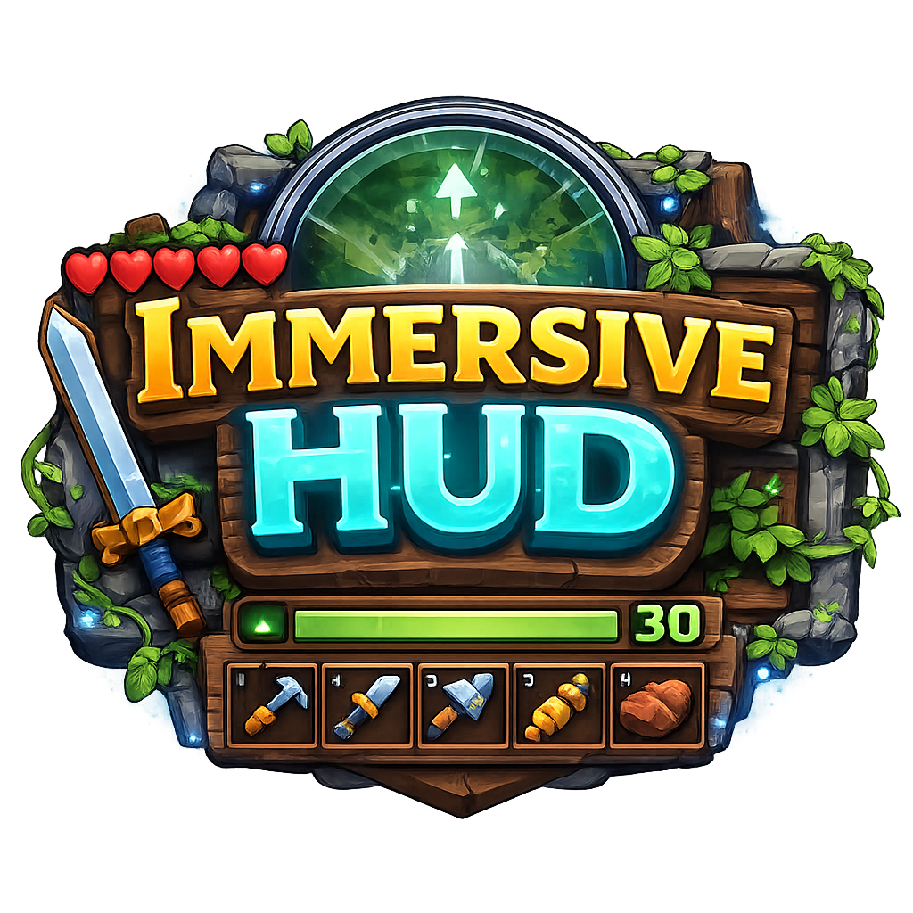
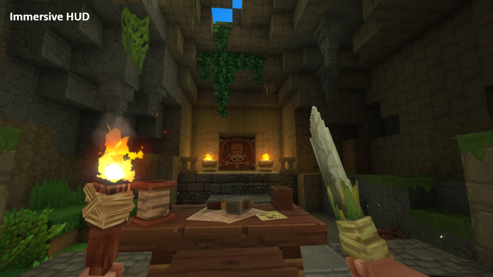

<p style="text-align:center; margin-bottom:-32px">

</p>
<p style="text-align:center; font-family:'Lucida Handwriting',cursive; font-size: 24px;">«Less Is More»</p>

# Immersive HUD

A server-side Hytale plugin that hides HUD elements and show them dynamically to create a cleaner and more immersive gameplay experience.




---

## Why ImmersiveHud?

| Feature                         | Vanilla HUD | ImmersiveHud |
|---------------------------------|:-----------:|:------------:|
| HUD always visible              |      ✔      |      ●       |
| Dynamic HUD behaviour           |      ✖      |      ✔       |
| Hide individual components      |      ✖      |      ✔       |
| Trigger-based visibility        |      ✖      |      ✔       |
| Per-player configuration        |      ✖      |      ✔       |
| In-game configuration commands  |      ✖      |      ✔       |
| Automatic HUD context detection |      ✖      |      ✔       |

ImmersiveHud keeps the screen clean during exploration while automatically displaying important information during gameplay.

---

## Technical highlights

- Codec-based config serialization with `BuilderCodec`
- Structured config sections for `HudComponents` and `DynamicHud`
- Per-player runtime HUD state tracking
- Automatic player config saving
- Packet watching for player interaction changes
- Scheduled HUD updates
- Defensive configuration sanitization
- Schema migration support
- Separate configuration layers:
  - Server default configuration
  - Per-player overrides

---

## Installation

1. Build the plugin using Gradle.
2. Copy the generated ImmersiveHud.jar into your server plugin directory or use `CurseForge` app.
3. Start the server.
4. The plugin will automatically generate the default configuration file.

You can then personalize the plugin using:
   - `/ihud` commands in-game
   - manual editing of the configuration files

---

## Building

Requirements:
- Java toolchain compatible with the project 
- Access to Hytale Maven repositories

Build the project using:
> ./gradlew build

The build produces a shaded plugin jar named:
> ImmersiveHud.jar

---

## Project Structure

```terminaloutput
src/main/java/com/tom/immersivehudplugin

ImmersiveHudPlugin.java

commands/
   CommandCollection.java
   ProfileCmd.java
   RulesCmd.java
   StatusCmd.java
   ToggleCmd.java
config/
   DynamicHudConfig.java
   DynamicHudRuleConfig.java
   GlobalConfig.java
   HudComponentsConfig.java
   PlayerConfig.java
context/
   HudContextBuilder
managers/
   PlayerConfigManager.java
profiles/
   Profile.java
   ProfilePresets.java
registry/
   HudComponentRegistry.java
rules/
   DynamicHudTriggers.java
   DynamicHudTriggersContext.java
runtime/
   HudRuntimeService
   HudSignal
   HudTimers
   PlayerHudState
   PlayerTickContext
utils/
   HudBarState.java
   ItemUtils.java
visibility/
   HudVisibilityService
```

---

## How it works

ImmersiveHud combines two visibility models.

### Static visibility

A component is always hidden or always visible.

Example:
- Input bindings
- Notifications
- Player list

Static components are controlled through:
- configuration files
- `/ihud toggle` commands

---

### Dynamic visibility

Dynamic components are normally hidden and become visible when specific gameplay triggers occur.

Examples:
- showing the reticle when targeting an entity
- showing the hotbar when changing the selected slot
- showing health bars when damage is taken

Multiple triggers can be combined to control when the component appears.

Example:
- showing the reticle when targeting an entity or aiming

Dynamic components are controlled through:
- configuration files
- `/ihud toggle` and `/ihud rules` commands

---

## Configuration

ImmersiveHud uses two configuration layers:

1. Server configuration (Global)
2. Per-player configuration

To configure ImmersiveHud behaviour you can edit manually the player config file or use in-game commands.

### Global Configuration file - `config.json`

The global configuration file is created automatically when the plugin is first loaded.

This file defines default settings for all players.

Configuration file path:

* ###### Windows:
> [%appdata%\Hytale\UserData\Saves\<world>\mods\TR_ImmersiveHud\config.json]()
* ###### Linux:
> [~/.local/share/Hytale/UserData/Saves/<world>/mods/TR_ImmersiveHud/config.json]()
* ###### MacOS:
> [~/Library/Application Support/Hytale/UserData/Saves/<world>/mods/TR_ImmersiveHud/config.json]()

Example:

```json
{
  "ConfigVersion": "0.8.0",
  "IntervalMs": 250,
  "HideDelayMs": 2000,
  "ReticleTargetRange": 8.0,
  "DefaultHudComponents": {
    "HideCompassHud": true,
    "HideReticleHud": true,
    "HideHealthHud": true,
    "HideStaminaHud": true,
    "HideManaHud": true,
    "HideOxygenHud": false,
    "HideHotbarHud": true,
    "HideInputBindingsHud": true,
    "HideStatusIconsHud": false,
    "HideAmmoIndicatorHud": false,
    "HideNotificationsHud": true,
    "HideUtilitySlotSelectorHud": false,
    "HideSpeedometerHud": true,
    "HideChatHud": false,
    "HideRequestsHud": false,
    "HideKillFeedHud": false,
    "HidePlayerListHud": false,
    "HideSleepHud": false,
    "HideEventTitleHud": false,
    "HideObjectivePanelHud": false,
    "HidePortalPanelHud": false,
    "HideBuilderToolsLegendHud": false,
    "HideBuilderToolsMaterialSlotSelectorHud": false,
    "HideBlockVariantSelectorHud": false
  },
  "DefaultDynamicHud": {
    "Hotbar": {
      "Rules": "HOTBAR_INPUT"
    },
    "Reticle": {
      "Rules": "AIMING,CONSUMABLE_USE,TARGET_ENTITY,INTERACTABLE_BLOCK"
    },
    "Compass": {
      "Rules": "MOVING"
    },
    "Health": {
      "Rules": "HEALTH_NOT_FULL"
    },
    "Stamina": {
      "Rules": "STAMINA_NOT_FULL"
    },
    "Mana": {
      "Rules": "MANA_NOT_FULL"
    }
  }
}
```
---

### Player Configuration File - `<playerUuid>.json`

A player configuration file is created automatically when the player first modifies HUD settings.

Player configuration file path:

* ###### Windows:
> [%appdata%\Hytale\UserData\Saves\<world>\mods\TR_ImmersiveHud\players\<playerUuid>.json]()

* ###### Linux:
> [~/.local/share/Hytale/UserData/Saves/<world>/mods/TR_ImmersiveHud/players/<playerUuid>.json]()

* ###### MacOS:
> [~/Library/Application Support/Hytale/UserData/Saves/<world>/mods/TR_ImmersiveHud/players/<playerUuid>.json]()

Player configurations:
- override the server defaults
- are saved automatically
- are reset using /ihud reset

#### Example player configuration file:

Name: _d79b674a-9e8f-49a2-b7b0-8adf427df179.json_

```json
{
  "hudComponents": {
    "hideCompassHud": true,
    "hideReticleHud": true,
    "hideHealthHud": true,
    "hideStaminaHud": true,
    "hideManaHud": true,
    "hideHotbarHud": true,
    "hideOxygenHud": true,
    "hideStatusIconsHud": false,
    "hideNotificationsHud": true,
    "hideInputBindingsHud": true,
    "hideSpeedometerHud": true,
    "hideAmmoIndicatorHud": true,
    "hideChatHud": true,
    "hidePlayerListHud": true,
    "hideRequestsHud": true,
    "hideKillFeedHud": true,
    "hideSleepHud": false,
    "hideEventTitleHud": false,
    "hideObjectivePanelHud": false,
    "hidePortalPanelHud": false,
    "hideBuilderToolsLegendHud": true,
    "hideUtilitySlotSelectorHud": true,
    "hideBlockVariantSelectorHud": true,
    "hideBuilderToolsMaterialSlotSelectorHud": true
  },
  "dynamicHud": {
    "hotbar": {
      "rulesCsv": "HOTBAR_INPUT"
    },
    "reticle": {
      "rulesCsv": "CHARGING_WEAPON,CONSUMABLE_USE,TARGET_ENTITY,INTERACTABLE_BLOCK,HOLDING_RANGED_WEAPON"
    },
    "compass": {
      "rulesCsv": "PLAYER_WALKING,PLAYER_RUNNING"
    },
    "health": {
      "rulesCsv": "ALWAYS_HIDDEN"
    },
    "stamina": {
      "rulesCsv": "ALWAYS_HIDDEN"
    },
    "mana": {
      "rulesCsv": "ALWAYS_HIDDEN"
    }
  }
}
```

---

## Commands

Commands to set up and personalize ImmersiveHud behaviour per player `/ihud <command> <parameters>`

| Command   | Parameters                        | Description                                                 | Example                              |
|-----------|-----------------------------------|-------------------------------------------------------------|--------------------------------------|
| `status`  | none                              | Displays the current visibility state of all HUD components | /ihud status                         |
| `toggle`  | `<component>`                     | Toggles visibility of a specific HUD component              | /ihud toggle health                  |
| `toggle`  | `<component>` `<state>`           | Hides/Shows a component                                     | /ihud toggle health hide             |
| `toggle`  | `<group>` `<state>`               | Hides/Shows all components in a group                       | /ihud toggle ui hide                 |
| `rules`   | `<component>` list                | List rules from a component                                 | /ihud rules health list              |
| `rules`   | `<component>` clear               | Clear rules from a component                                | /ihud rules health clear             |
| `rules`   | `<component>` add/remove `<rule>` | Add or remove rules to/from component                       | /ihud rules health add ALWAYS_HIDDEN |
| `profile` | `<profile>`                       | Apply quick IHud configuration based on different profiles  | /ihud profile immersive              |

Changes made through commands:
- affect only the current player
- are persisted automatically
- override the global config

| Parameter     | Description           | Values                                 |
|---------------|-----------------------|----------------------------------------|
| `<component>` | Hud component         | See section Supported Hud Components   |
| `<state>`     | Visibility state      | `[Hide/Show]`                          |
| `<group>`     | Hud group             | `[Core/Bars/UI/Social/Panels/Builder]` |
| `<rule>`      | Trigger Rules         | See section Dynamic Rules              |
| `<profile>`   | Configuration Profile | See section Profiles                   |

## Profiles

### Default 

Default configuration for ImmersiveHud. Designed for players who want a cleaner, more immersive experience without losing essential gameplay information. 

Most HUD elements stay hidden to reduce screen clutter and only appear when gameplay conditions trigger them through configurable activation rules.

### Immersive

Extreme immersive experience configuration. Designed for players who want the clearest immersive experience possible.

Activation rules have been reduced and even some elements (Like Health or Stamina bars) have been removed completely from HUD.

### Disabled

Restores default Hytale Hud visibility

| HUD Element     | `Default` Profile                                                                                 | `Immersive` Profile                                                                        |
| --------------- |---------------------------------------------------------------------------------------------------|--------------------------------------------------------------------------------------------|
| **Compass**     | Appears when the player is moving                                                                 | Appears only when the player is doing specific movements: running/swimming/mounting/flying |
| **Reticle**     | Appears during interactions: targeting entities, interactable blocks, consumables or weapon usage | Appears during reduced interactions: consumables or weapon usage                           |
| **Health Bar**  | Appears after the player receives damage                                                          | Permanently hidden                                                                         |
| **Stamina Bar** | Appears when the player is sprinting or fighting                                                  | Permanently hidden                                                                         |
| **Mana Bar**    | Appears while the player is consuming mana                                                        | Permanently hidden                                                                         |
| **Hotbar**      | Appears when the player is changing items in hand                                                 | Permanently hidden                                                                         |

Obviously you can use these profiles as base and then add or remove rules to customize your personal experience

---

## Supported HUD Components

### Static components

The visibility of these HUD components can be toggled off to hide them.

| Hud Component                 | Group   |
|-------------------------------|---------|
| oxygen                        | UI      |
| inputbindings                 | UI      |
| notifications                 | UI      |
| speedometer                   | UI      |
| statusicons                   | UI      |
| ammoindicator                 | UI      |
| utilityslotselector           | UI      |
| chat                          | Social  |
| requests                      | Social  |
| killfeed                      | Social  |
| playerlist                    | Social  |
| eventtitle                    | Panels  |
| objectivepanel                | Panels  |
| portalpanel                   | Panels  |
| sleep                         | Panels  |
| buildertoolslegend            | Builder |
| buildermaterialsslotselector  | Builder |
| blockvariantselector          | Builder |

### Dynamic components

The visibility of these components can be toggled off to hide them, and then different rules can be applied to show them when needed.
If the HUD component is set to be hidden and no rules are defined it will remain hidden.

| Hud Component                 | Group |
|-------------------------------|-------|
| hotbar                        | Core  |
| compass                       | Core  |
| reticle                       | Core  |
| health                        | Bars  |
| stamina                       | Bars  |
| mana                          | Bars  |

---

## Dynamic Rules

Dynamic rules define when a HUD component becomes visible.

Rules can be combined using a comma-separated list in the configuration.

| Rule                    | Trigger condition                           |
|-------------------------|---------------------------------------------|
| `HOTBAR_INPUT`          | Player changes hotbar selection             |
| `CHARGING_WEAPON`       | Player is aiming or charging a weapon       |
| `CONSUMABLE_USE`        | Player is consuming food or potion          |
| `TARGET_ENTITY`         | Player is targeting an entity               |
| `INTERACTABLE_BLOCK`    | Player is looking at an interactable blocks |
| `PLAYER_MOVING`         | Player is moving                            |
| `PLAYER_WALKING`        | Player is walking                           |
| `PLAYER_RUNNING`        | Player is running                           |
| `PLAYER_SPRINTING`      | Player is sprinting                         |
| `PLAYER_MOUNTING`       | Player is mounting                          |
| `HOLDING_MELEE_WEAPON`  | Player is holding a melee weapon            |
| `HOLDING_RANGED_WEAPON` | Player is holding a ranged weapon           |
| `HEALTH_NOT_FULL`       | Health bar is not full                      |
| `HEALTH_LOW`            | Health bar is below 50%                     |
| `HEALTH_CRITICAL`       | Health bar is below 25%                     |
| `STAMINA_NOT_FULL`      | Stamina bar is not full                     |
| `STAMINA_LOW`           | Stamina bar is below 50%                    |
| `STAMINA_CRITICAL`      | Stamina bar is below 25%                    |
| `MANA_NOT_FULL`         | Mana bar is not full                        |
| `MANA_LOW`              | Mana bar is below 50%                       |
| `MANA_CRITICAL`         | Mana bar is below 25%                       |

Example configuration:

    HOLDING_RANGED_WEAPON,CONSUMABLE_USE,TARGET_ENTITY

Default dynamic rules configuration:

| Component | Rules                                                                            |
|-----------|:---------------------------------------------------------------------------------|
| Hotbar    | `HOTBAR_INPUT`                                                                   |
| Reticle   | `HOLDING_RANGED_WEAPON`, `CONSUMABLE_USE`, `TARGET_ENTITY`, `INTERACTABLE_BLOCK` |
| Compass   | `MOVE`                                                                           |
| Health    | `HEALTH_NOT_FULL`                                                                |
| Stamina   | `STAMINA_CRITICAL`                                                               |
| Mana      | `MANA_CRITICAL`                                                                  |

You can apply different combinations to alter HUD component behaviour. For example:

| Component | Applied rules                     | Shown only when                                      |
|-----------|-----------------------------------|------------------------------------------------------|
| Hotbar    | `HOTBAR_INPUT`, `CHARGING_WEAPON` | when the player changes hotbar input and when aiming |

---

## Roadmap

Possible future improvements:
- GUI configuration menu
- Additional dynamic triggers: 
  - ~~PLAYER_MOUNTING~~
  - PLAYER_FLYING
  - PLAYER_GLIDING
  - IN_COMBAT
- ~~Preset configurations~~
- Import / export config profiles
- Add support for future Hud components

---

## Contributing

Contributions, suggestions and feedback are welcome.

If you find a bug or want to propose improvements:

1. Open an issue
2. Describe the problem or feature request
3. Include logs if applicable

---

## Author

T0mR4nD0m t0mr4nd0m@gmail.com