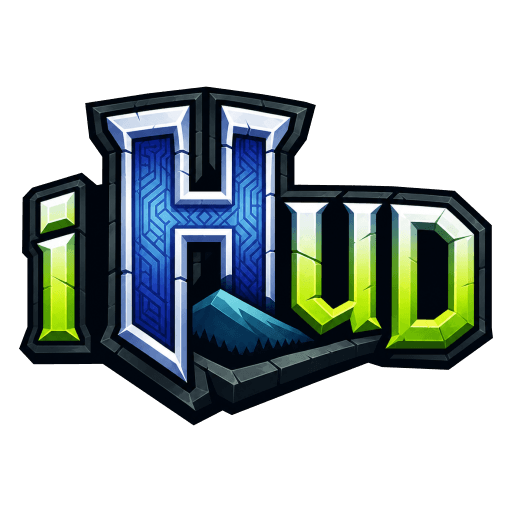
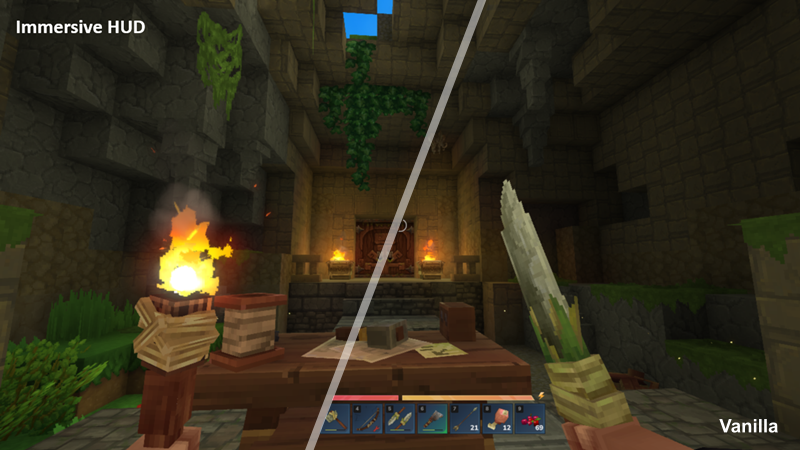
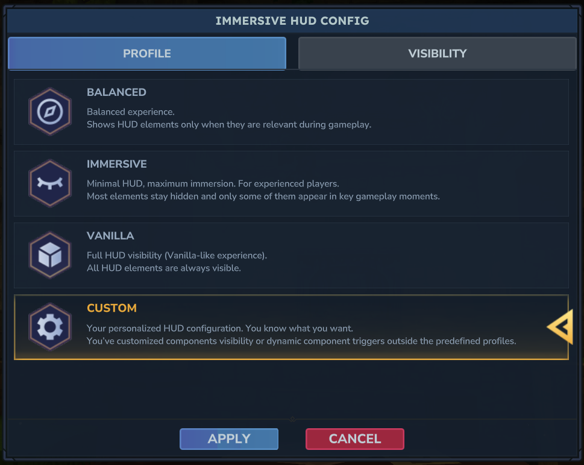
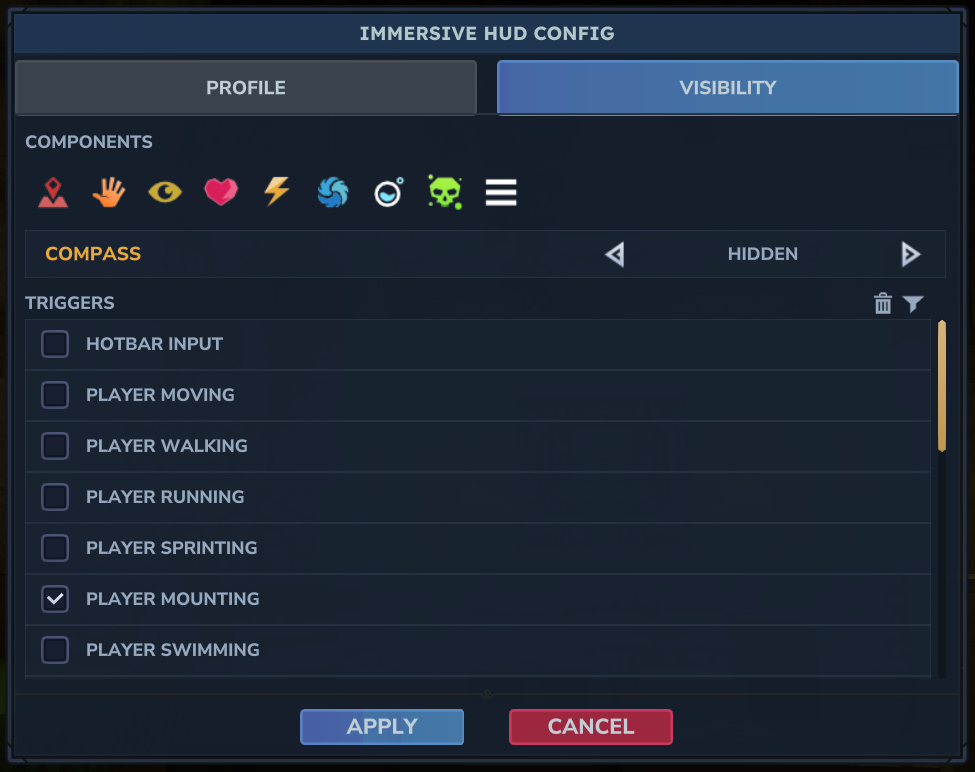

<p style="text-align:center; margin-bottom:-32px">

</p>

<p style="text-align:center;"></p>

# Immersive HUD

<span style="color:orange">ImmersiveHUD</span> is a lightweight, fully configurable Hytale mod designed to reduce visual HUD noise without losing critical information.

Instead of disabling HUD elements, it makes them context-aware: they appear only when relevant and disappear when not needed.

It uses a flexible trigger system and ready-to-use profiles, making it quick and easy to customize the player experience.

It shows only what matters, when it matters, delivering a cleaner and more immersive experience.

By T0m.R4nD0m / [t0mr4nd0m@gmail.com](mailto:t0mr4nd0m@gmail.com)


---

## ✨ Features

- Dynamic HUD visibility based on gameplay
- Configurable triggers per component
- Built-in config profiles (balanced, immersive, vanilla)
- Per-player configuration
- Lightweight and performance-friendly
- Custom config UI

---

## ⚡ Quick Start

Get <span style="color:orange">ImmersiveHUD</span> running in under a minute:

### 1. Install the mod

- **CurseForge App** : (recommended)
  - Install [CurseForge App](https://www.curseforge.com/download/app)
  - Search 'ImmersiveHud' mod and install it


- **Manually** :
  - Download the latest release `.jar` from the [Releases](https://github.com/t0mr4nd0m/hytale.immersivehud/releases) page
  - Place it in your Hytale\UserData\Mods folder

  >   Windows: %appdata%\Hytale\UserData\Mods

  >   Linux: ~/.local/share/Hytale/UserData/Mods

  >   macOS: ~/Library/Application Support/Hytale/UserData/Mods

### 2. Start your server
- Launch your Hytale server and activate the mod

### 3. You're done
The HUD will now dynamically hide or show based on gameplay actions and conditions.

---

💡 Tip: Use command `/ihud config` to customize your HUD configuration.

---

## 📖 How it works

ImmersiveHud combines two visibility models.

### 🅰️ Static visibility

A static HUD component is always hidden or visible.

Example: Input bindings, Notifications, Player list, Chat,...

---

### ️🅱️ Dynamic visibility

Dynamic HUD components are hidden by default and become visible when at least one rule matches the current gameplay context.

* Dynamic HUD component behaviour is defined by the dynamic rules assigned to it.
* Different rules can be applied to same component to react to different triggers.
* If no rules are assigned to the dynamic component, it will behave as a static component.

Examples:
- showing the hotbar when changing the slot selected
- showing health bar when damage is taken
- showing the reticle when looking at a workbench or aiming with a bow

---

## 📘 HUD Components

HUD components supported by ImmersiveHUD

| Component                                        | Group   | Type    | Default state | Default rules                                                                                   |
|--------------------------------------------------|---------|---------|---------------|-------------------------------------------------------------------------------------------------|
| <span style="color:orange">hotbar</span>         | Core    | Dynamic | Hidden        | `HOTBAR_INPUT`                                                                                  |
| <span style="color:orange">compass</span>        | Core    | Dynamic | Hidden        | `PLAYER_MOVING`                                                                                 |
| <span style="color:orange">reticle</span>        | Core    | Dynamic | Hidden        | `CHARGING_WEAPON` `CONSUMABLE_USE` `TARGET_ENTITY` `INTERACTABLE_BLOCK` `HOLDING_RANGED_WEAPON` |
| <span style="color:orange">health</span>         | Bars    | Dynamic | Hidden        | `HEALTH_NOT_FULL`                                                                               |
| <span style="color:orange">stamina</span>        | Bars    | Dynamic | Hidden        | `STAMINA_NOT_FULL`                                                                              |
| <span style="color:orange">mana</span>           | Bars    | Dynamic | Hidden        | `MANA_NOT_FULL`                                                                                 |
| <span style="color:orange">oxygen</span>         | Bars    | Dynamic | Hidden        | `OXYGEN_NOT_FULL`                                                                               |
| <span style="color:orange">statusicons</span> ⚠️ | UI      | Dynamic | Visible       | `HOTBAR_INPUT`                                                                                  |
| <span style="color:orange">ammo</span> ⚠️        | UI      | Dynamic | Visible       | `HOLDING_RANGED_WEAPON`                                                                         |
| inputbindings ⚠️                                 | UI      | Static  | Hidden        | —                                                                                               |
| notifications                                    | UI      | Static  | Hidden        | —                                                                                               |
| speedometer                                      | UI      | Static  | Visible       | —                                                                                               |
| utilityslotselector                              | UI      | Static  | Visible       | —                                                                                               |
| chat                                             | Social  | Static  | Visible       | —                                                                                               |
| requests                                         | Social  | Static  | Visible       | —                                                                                               |
| killfeed                                         | Social  | Static  | Visible       | —                                                                                               |
| playerlist                                       | Social  | Static  | Visible       | —                                                                                               |
| eventtitle                                       | Panels  | Static  | Visible       | —                                                                                               |
| objectivepanel                                   | Panels  | Static  | Visible       | —                                                                                               |
| portalpanel                                      | Panels  | Static  | Visible       | —                                                                                               |
| sleep                                            | Panels  | Static  | Visible       | —                                                                                               |
| blockvariantselector                             | Builder | Static  | Visible       | —                                                                                               |
| buildertoolslegend                               | Builder | Static  | Visible       | —                                                                                               |
| buildertoolsmaterialslotselector                 | Builder | Static  | Visible       | —                                                                                               |

⚠️ This component is affected by some kind of issue in Hytale API. See `Know Issues` section for more details and possible workarounds

All bar components (Health, Stamina, Mana and Oxygen) support threshold-based visibility.

---

## 🏷️ Rules

Rules to define the visibility behaviour of dynamic HUD components

| Rule                    | Trigger condition                                  |
|-------------------------|----------------------------------------------------|
| `HOTBAR_INPUT`          | Player changes hotbar selection                    |
| `CONSUMABLE_USE`        | Player is consuming food or potion                 |
| `TARGET_ENTITY`         | Player is targeting an entity                      |
| `INTERACTABLE_BLOCK`    | Player is looking at interactable blocks           |
| `PLAYER_MOVING`         | Player is moving                                   |
| `PLAYER_WALKING`        | Player is walking                                  |
| `PLAYER_RUNNING`        | Player is running                                  |
| `PLAYER_SPRINTING`      | Player is sprinting                                |
| `PLAYER_MOUNTING`       | Player is mounting                                 |
| `PLAYER_FLYING`         | Player is flying                                   |
| `PLAYER_GLIDING`        | Player is gliding                                  |
| `PLAYER_JUMPING`        | Player is jumping                                  |
| `PLAYER_CROUCHING`      | Player is crouching                                |
| `PLAYER_CLIMBING`       | Player is climbing                                 |
| `PLAYER_IN_FLUID`       | Player is in fluid                                 |
| `PLAYER_ON_GROUND`      | Player is on ground                                |
| `PLAYER_FALLING`        | Player is falling                                  |
| `PLAYER_SITTING`        | Player is sitting                                  |
| `PLAYER_ROLLING`        | Player is rolling                                  |
| `CHARGING_WEAPON`       | Player is aiming or charging a weapon              |
| `HOLDING_MELEE_WEAPON`  | Player is holding a melee weapon                   |
| `HOLDING_RANGED_WEAPON` | Player is holding a ranged weapon                  |
| `BLOCKING_ATTACK`       | Player is using a weapon to block an attack        |
| `IN_COMBAT`             | Player is in combat (some mob is attacking player) |
| `HEALTH_NOT_FULL`       | Health bar is not full                             |
| `STAMINA_NOT_FULL`      | Stamina bar is not full                            |
| `MANA_NOT_FULL`         | Mana bar is not full                               |
| `OXYGEN_NOT_FULL`       | Oxygen bar is not full                             |

When activating any rule bar `_NOT_FULL`, use `Threshold` to specify the bar level at which the component becomes visible.

Examples:
- Threshold = 100 → visible whenever the bar is not full
- Threshold = 50 → visible below half
- Threshold = 25 → visible only in critical situations

---

💡 Tip: multiple rules can be combined to alter component behaviour. Ex. Hotbar rules=`HOTBAR_INPUT`, `CHARGING_WEAPON` -> when changes hotbar slot and when aiming.

---

##  🎮 Profiles

Profiles provide predefined HUD configurations for different playstyles.  
You can switch between them instantly using commands.

| Profile     | Description                                       |
|-------------|---------------------------------------------------|
| `Balanced`  | Balanced. Shows HUD components only when relevant |
| `Immersive` | Minimal HUD, maximum immersion                    |
| `Vanilla`   | HUD always visible (vanilla-like)                 |
| `Custom`    | Custom profile defined by player                  |

---

## ⚙️ Configuration

To configure ImmersiveHud behaviour you can edit manually the player config file, use in-game commands 
or even better, use in-game **Config UI**

### Config UI

Use command `/ihud config` to open in-game configuration UI to manage visibility, rules and profiles interactively.

1. Select one of the available profiles to start customizing your experience
<p style="text-align:center;"></p>

2. Configure the visibility and rules to hide or show the different HUD elements
<p style="text-align:center;"></p>

Finally, press **APPLY** to save and activate your configuration and start enjoying your new Immersive HUD experience.

---

ImmersiveHud uses two configuration layers:

1. Server configuration (Global)
2. Per-player configuration

### Global Configuration file - `config.json`

The global configuration file is created automatically when the mod is first loaded.

This file defines default settings for all players.

Configuration file path:

> **Windows**: %appdata%\Hytale\UserData\Saves\<world>\mods\TR_ImmersiveHud\config.json

> **Linux**: ~/.local/share/Hytale/UserData/Saves/<world>/mods/TR_ImmersiveHud/config.json

> **macOS**: ~/Library/Application Support/Hytale/UserData/Saves/<world>/mods/TR_ImmersiveHud/config.json

Example:

```json
{
  "ConfigVersion": "1.2.4",
  "IntervalMs": 250,
  "HideDelayMs": 2000,
  "ReticleTargetRange": 8.0,
  "DefaultHudComponents": {
    "HideHealth": true,
    "HideStamina": true,
    "HideMana": true,
    "HideOxygen": false,
    "HideCompass": true,
    "HideHotbar": true,
    "HideReticle": true,
    "HideInputBindings": true,
    "HideNotifications": true,
    "HideStatusIcons": false,
    "HideSpeedometer": false,
    "HideAmmoIndicator": false,
    "HideUtilitySlotSelector": false,
    "HideChat": false,
    "HideRequests": false,
    "HideKillFeed": false,
    "HidePlayerList": false,
    "HideEventTitle": false,
    "HideObjectivePanel": false,
    "HidePortalPanel": false,
    "HideSleep": false,
    "HideBlockVariantSelector": false,
    "HideBuilderToolsLegend": false,
    "HideBuilderToolsMaterialSlotSelector": false
  },
  "DefaultDynamicHud": {
    "Health": {
      "Rules": [
        "HEALTH_NOT_FULL"
      ],
      "Threshold": 100.0
    },
    "Stamina": {
      "Rules": [
        "STAMINA_NOT_FULL"
      ],
      "Threshold": 100.0
    },
    "Mana": {
      "Rules": [
        "MANA_NOT_FULL"
      ],
      "Threshold": 100.0
    },
    "Oxygen": {
      "Rules": [
        "OXYGEN_NOT_FULL"
      ],
      "Threshold": 100.0
    },
    "Compass": {
      "Rules": [
        "PLAYER_MOVING"
      ]
    },
    "Hotbar": {
      "Rules": [
        "HOTBAR_INPUT"
      ]
    },
    "Reticle": {
      "Rules": [
        "CHARGING_WEAPON",
        "CONSUMABLE_USE",
        "TARGET_ENTITY",
        "INTERACTABLE_BLOCK",
        "HOLDING_RANGED_WEAPON"
      ]
    }
  }
}
```
---

### Player Configuration File - `<playerUuid>.json`

A player configuration file is created automatically when the player first modifies HUD settings.

Player configuration file path:

> **Windows**: %appdata%\Hytale\UserData\Saves\<world>\mods\TR_ImmersiveHud\players\<playerUuid>.json

> **Linux**: ~/.local/share/Hytale/UserData/Saves/<world>/mods/TR_ImmersiveHud/players/<playerUuid>.json

> **macOS**: ~/Library/Application Support/Hytale/UserData/Saves/<world>/mods/TR_ImmersiveHud/players/<playerUuid>.json

Player configurations:
- override the server defaults
- are saved automatically

#### Example player configuration file:

Name: _d79b674a-9e8f-49a2-b7b0-8adf427df179.json_

```json
{
  "HudComponents": {
    "HideHealth": true,
    "HideStamina": true,
    "HideMana": true,
    "HideOxygen": true,
    "HideCompass": true,
    "HideHotbar": true,
    "HideReticle": true,
    "HideInputBindings": true,
    "HideNotifications": true,
    "HideStatusIcons": false,
    "HideSpeedometer": false,
    "HideAmmoIndicator": false,
    "HideUtilitySlotSelector": false,
    "HideChat": false,
    "HideRequests": false,
    "HideKillFeed": false,
    "HidePlayerList": false,
    "HideEventTitle": false,
    "HideObjectivePanel": false,
    "HidePortalPanel": false,
    "HideSleep": false,
    "HideBlockVariantSelector": false,
    "HideBuilderToolsLegend": false,
    "HideBuilderToolsMaterialSlotSelector": false
  },
  "DynamicHud": {
    "Health": {
      "Rules": [
        "HEALTH_NOT_FULL"
      ],
      "Threshold": 25.0
    },
    "Stamina": {
      "Rules": [
        "STAMINA_NOT_FULL"
      ],
      "Threshold": 25.0
    },
    "Mana": {
      "Rules": [
        "MANA_NOT_FULL"
      ],
      "Threshold": 25.0
    },
    "Oxygen": {
      "Rules": [
        "OXYGEN_NOT_FULL"
      ],
      "Threshold": 25.0
    },
    "Compass": {
      "Rules": [
        "PLAYER_CROUCHING"
      ]
    },
    "Hotbar": {
      "Rules": [
        "HOTBAR_INPUT"
      ]
    },
    "Reticle": {
      "Rules": [
        "CHARGING_WEAPON",
        "CONSUMABLE_USE",
        "TARGET_ENTITY",
        "INTERACTABLE_BLOCK",
        "HOLDING_RANGED_WEAPON"
      ]
    }
  }
}
```

---

## 🛠️ Technical highlights
- Dynamic HUD visibility system based on rules and triggers
- Robust configuration system: auto-generated and self-healing configs
- Per-player configuration system
- Quick configuration profiles system
- Command-driven configuration control
- Lightweight event & packet-driven state tracking
- Clean and extensible design
- Custom Config UI

---

## 🔧 Building

Requirements:
- Java toolchain compatible with the project
- Access to Hytale Maven repositories

Build the project using:
> ./gradlew build

The build produces a shaded mod jar named:
> ImmersiveHud.jar

---

## 📁 Project Structure

```terminaloutput
src/main/java/com/tom/immersivehudplugin

ImmersiveHudPlugin.java

  commands/
     IHudCommands.java
     ConfigCmd.java
  config/
     ConfigJsonMapper.java
     ConfigSchemaValidator.java
     ConfigSupport.java
     DynamicHudConfig.java
     DynamicHudRuleConfig.java
     GlobalConfig.java
     GlobalConfigStore.java
     HudComponentsConfig.java
     PlayerConfig.java
     PlayerConfigService.java
     PlayerConfigStore.java
     
  hud/
     component/
        HudComponent.java
        HudComponentCatalog.java
        HudComponentRegistry.java
     trigger/
        HudBarState.java
        HudTrigger.java
        HudTriggerContext.java
        
  profiles/
     Profile.java
     ProfilePresets.java
  
  runtime/
     DynamicHudCache.java
     HudRuntimeService.java
     HudTickProcessor.java
     HudTimers.java
     PlayerHeldItemState.java
     PlayerHudState.java
     PlayerLifecycleService.java
     context/
        HudStateUpdater.java
        HudTriggerContextFactory.java
        PlayerTickContext.java
        PLayerTickContextFactory.java
     signal/
        CombatSignalScanner.java
        CombatSignalTracker.java
        HeldItemSignalTracker.java
        HeldItemState.java
        HudSignalPipeline.java
        MovementSignalTracker.java
        ReticleSignalTracker.java
     visibility/
        HudDeltaApplier.java
        HudRuleEvaluator.java
        HudVisibilityCoordinator.java
        
  ui/
     HudConfigPresenter.java
     HudConfigProfilesRenderer.java
     HudConfigUiService.java
     HudConfigUiSession.java
     HudConfigView.java
     HudConfigVisibilityRenderer.java
     HudConfigPage.java
     VisibilityComponentSelectorRenderer
     VisibilityDynamicDetailRenderer
     VisibilityStaticDetailRenderer
   
src/main/resources/Common/UI/Custom/

  IHudConfigPage.ui
  
  Assets/
    
  Views/
    ProfileRow.ui
    ProfilesView.ui
    VisibilityComponentButton.ui
    VisibilityStaticHeader.ui
    VisibilityStaticRow.ui
    VisibilityTriggerRow.ui
    VisibilityView.ui

src/main/resources/Server/Languages/

  en-US/
    immersivehud.lang
```

---

## 🐞 Known Issues

- [Input Bindings do not hide completely](https://github.com/t0mr4nd0m/hytale.immersivehud/issues/7)
- [Status Icons cannot be hidden](https://github.com/t0mr4nd0m/hytale.immersivehud/issues/8)
- [Network Quality icon cannot be hidden](https://github.com/t0mr4nd0m/hytale.immersivehud/issues/9)
- Ammo indicator is always hidden

Check them in GitHub to look for workarounds or fixes.

---

## 🚧 Roadmap

Possible future improvements:
- ~~GUI configuration menu~~
- ~~Additional dynamic triggers:~~
  - ~~PLAYER_FLYING~~
  - ~~PLAYER_GLIDING~~
  - ~~IN_COMBAT~~
- Import / export custom config profiles
- Support for future Hytale Hud components
- Support for Hud components from other mods (IHUD API)

---

## 📢 Contributing

Contributions, suggestions and feedback are welcome.

If you find a bug or want to propose improvements:

1. Open an issue
2. Describe the problem or feature request
3. Include logs if applicable